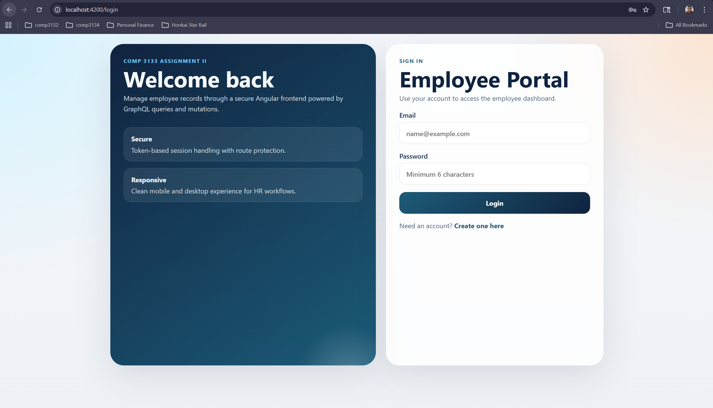
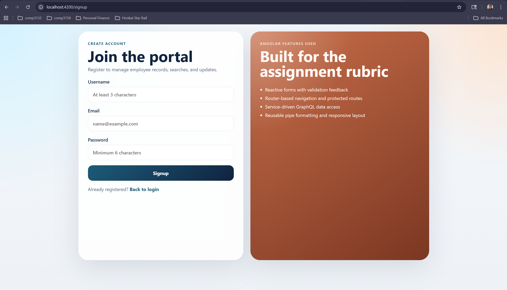
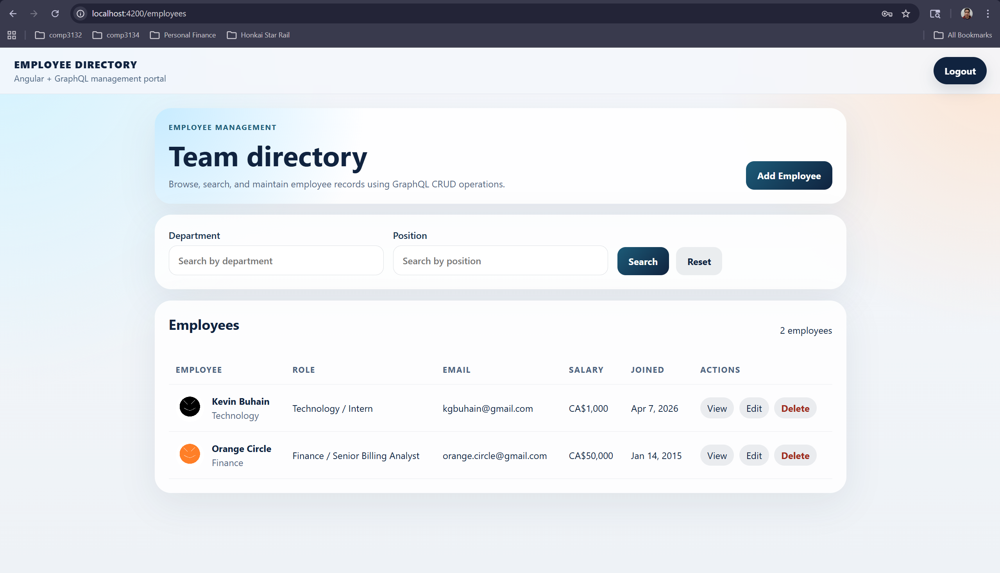
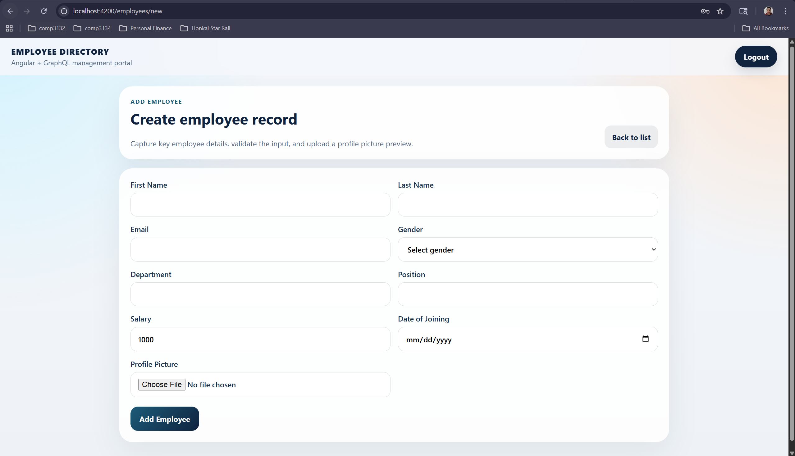
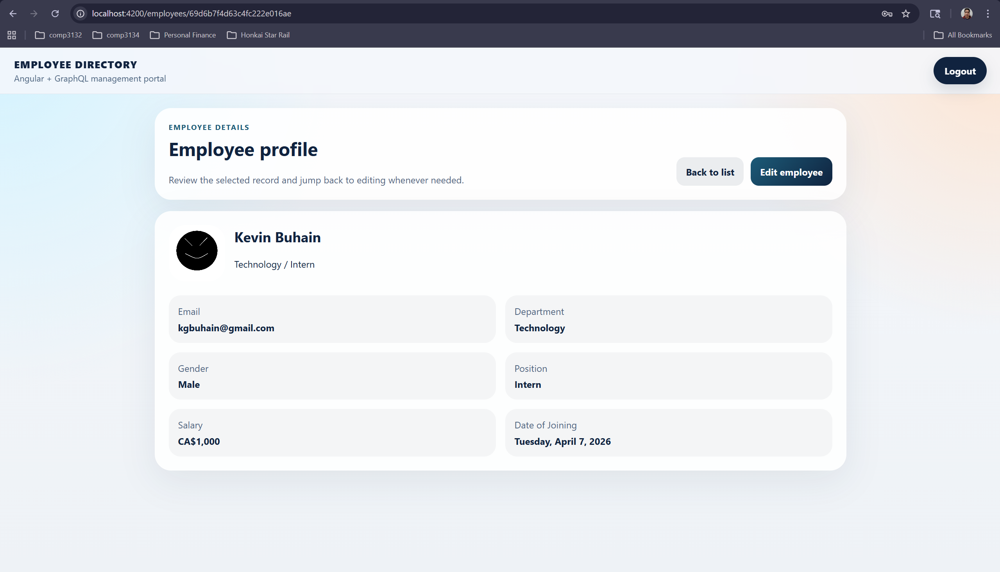
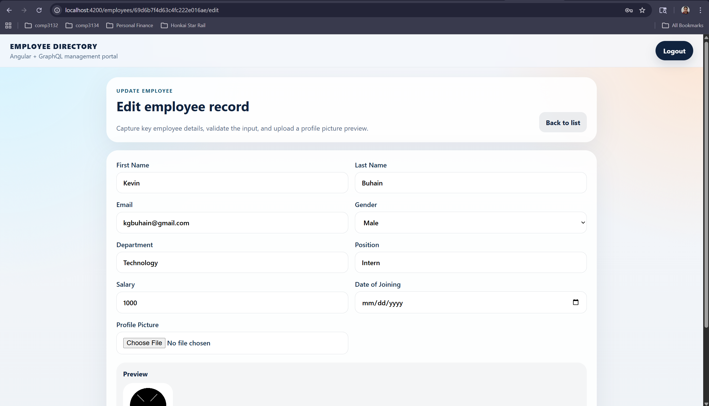
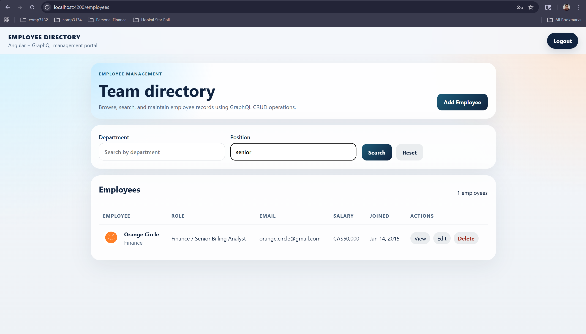

# 101505276_comp3133_assignment

COMP 3133 Assignment II workspace using this structure:

```text
101505276_comp3133_assignment/
├── docker-compose.yml
├── frontend/
└── backend/
```

The frontend is an Angular employee management app that connects to the Assignment I GraphQL backend.

## Technologies Used

- Angular 21
- TypeScript
- GraphQL
- Node.js
- Express
- MongoDB
- Mongoose
- Docker
- Docker Compose
- HTML
- CSS

## Project Structure

- `frontend/`: Angular frontend for login, signup, employee CRUD, search, routing, guards, and session handling
- `backend/`: Assignment I GraphQL backend used by the frontend
- `docker-compose.yml`: starts the frontend and backend together

## Database Connection

The Dockerized backend is configured to use the same MongoDB connection details as Assignment I through `backend/.env`.

- Database name: `comp3133_101505276_Assignment1`
- Backend GraphQL URL: `http://localhost:4000/graphql`
- Frontend URL: `http://localhost:4200`

This means the backend is intended to connect to the same Assignment I database, not a separate temporary Docker Mongo database.

## Environment Setup

`backend/.env` is not committed to GitHub. Anyone cloning the repo must create their own `backend/.env` before running the app.

Use the provided example file:

```powershell
Copy-Item backend\.env.example backend\.env
```

Then update `backend/.env` with your own values.

Required variables:

- `PORT=4000`
- `MONGO_URI=your_mongodb_connection_string`
- `MONGO_DB_NAME=comp3133_101505276_Assignment1`
- `JWT_SECRET=your_jwt_secret`
- `CLOUD_NAME=your_cloudinary_cloud_name`
- `CLOUD_KEY=your_cloudinary_api_key`
- `CLOUD_SECRET=your_cloudinary_api_secret`

If you want to keep using the same Assignment I database, copy the MongoDB and backend environment values from your Assignment I project into `backend/.env`.

## Run With Docker

From the repo root:

```powershell
Copy-Item backend\.env.example backend\.env
```

Update `backend/.env`, then run:

```powershell
docker compose up --build -d
```

Then open:

- Frontend: `http://localhost:4200/login`
- Backend GraphQL: `http://localhost:4000/graphql`

To stop the app:

```powershell
docker compose down
```

## Run Locally Without Docker

Backend:

```powershell
Copy-Item .env.example .env
```

Update `backend/.env`, then run:

```powershell
cd backend
npm install
npm start
```

Frontend:

```powershell
cd frontend
npm install
npm start
```

Then open:

- Frontend: `http://localhost:4200/login`
- Backend GraphQL: `http://localhost:4000/graphql`

## Features Implemented

- Angular routing for login, signup, employee list, employee details, and employee form
- Reactive forms with validation
- Session token storage through Angular services
- Route protection for authenticated pages
- GraphQL login, signup, employee CRUD, and search integration
- Employee search by department or position
- Responsive UI for desktop and mobile
- Logout and redirect flow

## Screenshots

### Login



### Signup



### Employee List



### Add Employee



### Employee Details



### Update Employee



### Search Results



## Notes

- The frontend has been aligned to the backend GraphQL schema from Assignment I.
- Employee search is case-insensitive in the backend.
- Docker uses the backend environment file in `backend/.env`.
- `backend/.env.example` is a template only and should be copied to `backend/.env` before running the project.
- The frontend Docker setup serves the built Angular SSR app on port `4200`.

## Build Check

Frontend build:

```powershell
cd frontend
npm run build
```
